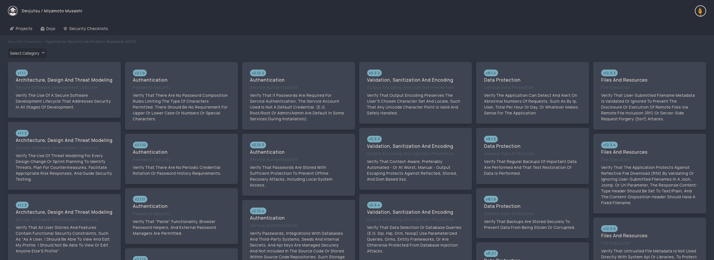
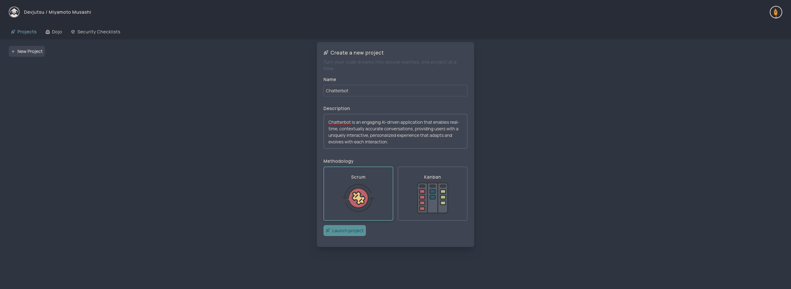
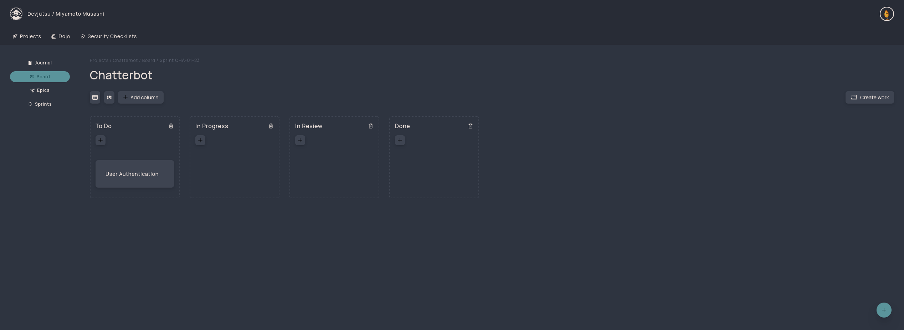

# Devjutsu - Security Meets Software Engineering

•
[Summary](#summary)
•
[Features](#-features)
•
[Screenshot](#-screenshots)
•
[Roadmap](/ROADMAP.md)
•
[Changelog](/CHANGELOG.md)

## Summary

Devjutsu: An agile project management tool streamlining secure software development for all developers. Craft user stories, integrate security requirements, and produce secure code seamlessly.

## Features

**Security Requirements Mapping (In Development)**: Devjutsu stands out in the realm of project management tools with its pioneering feature of "Security Requirements Mapping". This unique capability empowers developers to seamlessly integrate security considerations directly into their software engineering workflow. By analyzing individual user stories, Devjutsu associates them with relevant security controls, ensuring that each development task incorporates the essential security measures. As we continue to refine this feature, users can look forward to a more intuitive and efficient way to embed security into every facet of their projects. Stay tuned for more general project management features that will complement this core functionality.

## Screenshots

**ASVS Controls**

**Creating a new project**

**Project Board (In Development)**

